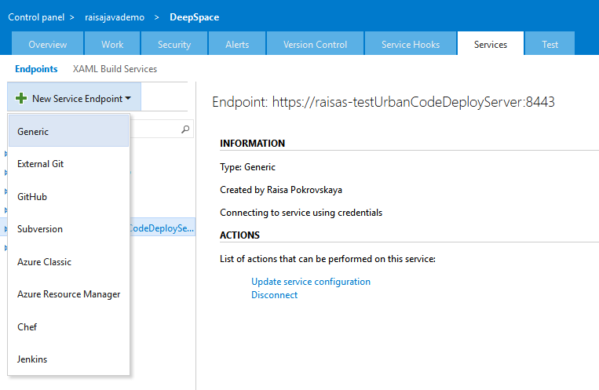
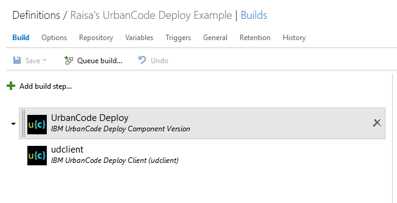
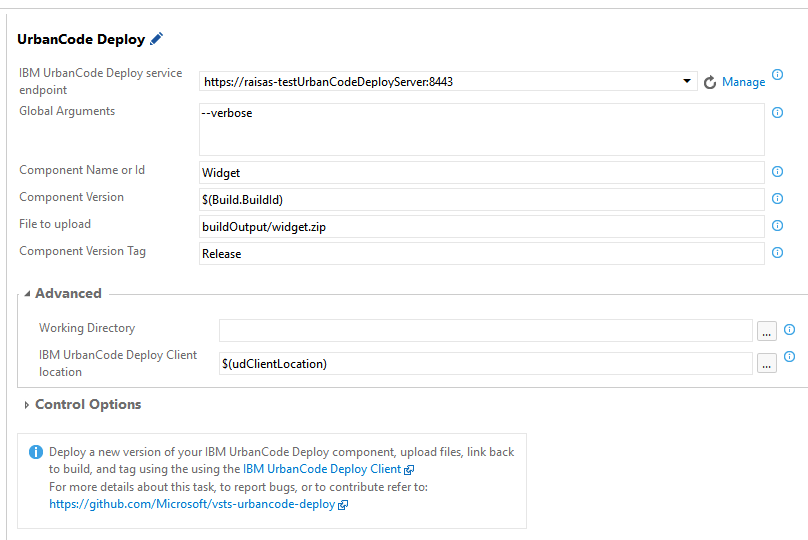
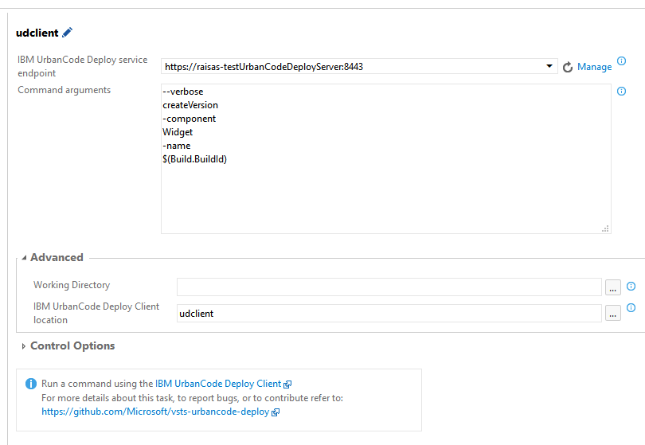

# Integrate with IBM UrbanCode Deploy
This extension provides build tasks that enable you to integrate with IBM UrbanCode Deploy using the [Command-line client](http://www.ibm.com/support/knowledgecenter/SS4GSP_6.2.1/com.ibm.udeploy.reference.doc/topics/cli_ch.html).

## Create a IBM UrbanCode Deploy Connection
Create a Generic Service Endpoint and specify your IBM UrbanCode Deploy endpoint URL, username and password, or just password for token autentication.

## Define your build process
Create a build definition to automate your build process. For detailed instructions on setting up a build definition, check out [this](https://msdn.microsoft.com/library/vs/alm/build/define/create).

Add one of the IBM UrbanCode Deploy Build tasks to your build steps and specify the input arguments.

Use the IBM UrbanCode Deploy Component Version task to easily create a component version for the build, upload files to the component, link back to the build, and tag the component.

Use the IBM UrbanCode Deploy Client task to run any command supported by the [IBM UrbanCode Deploy Command-line client](http://www.ibm.com/support/knowledgecenter/SS4GSP_6.2.1/com.ibm.udeploy.reference.doc/topics/cli_ch.html).

## Learn more
More documentation is available [here](https://github.com/Microsoft/vsts-urbancode-deploy).

## License
The [code](https://github.com/Microsoft/vsts-urbancode-deploy) is open sourced under the MIT license. We love and encourage community contributions.  